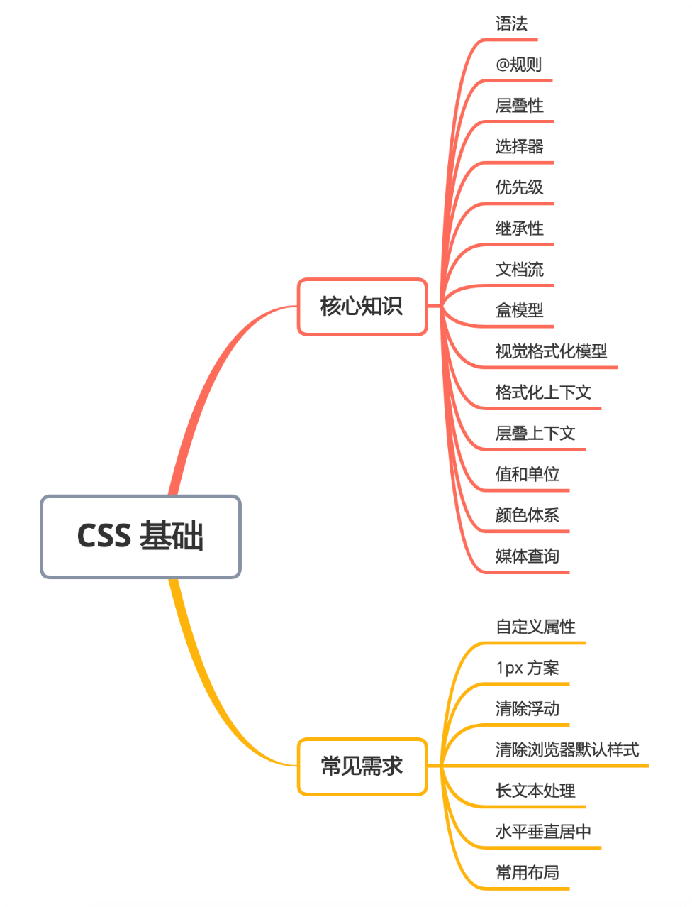

## CSS基础


### 核心概念和知识点
#### 语法
CSS属性和值组成的键值对，将一对或多对声明用{}包裹起来组成了一个声明块，声明块前添加选择器，CSS属性才能作用到对应的html元素。选择器 + 声明块组成了 CSS 规则集(CSS ruleset)即CSS规则。
```css
div {
    color: red;
    text-align: center;
}
//CSS 中的注释
/* 单行注释 */
/* 
    多行注释 
*/

```
